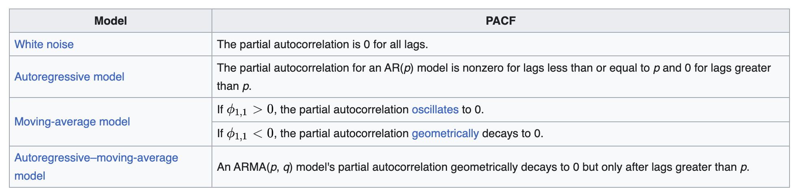

# Stochastische Prozesse und Zeitreihenanalyse

## Typisches Vorgehen

- Kontinuierliches Zeitfenster
- Fehlende Werte imputiereren (Bsp. Kalman für Physikalische Grössen)
- Dekomposition (Zeitreihe Stationär)
  - Trend (Glattkomponente, Movingaverage, Tiefpass, TBATS, Strukturelle Modellierung, LOES)
  - Saisonalität (Fourier Koeffizient)
  - Residuum (weisses Rauschen) sobald keine Systematik

## Stationarität: Würfel zu jedem Zeitpunkt in der Zeitreihe

- Mean = Konstant
  - $\bar{x} = \frac{1}{N} \sum_{t=1}^{N}{x_t}$
  - Augmented Dickey Fuller Test
- Varianz = Konstant
  - $s^2 = \frac{1}{N} \sum_{t=1}^{N}{(x_t - \bar{x})^2}$
  - Varianz vom Zeitpunkt t ist ein Würfelprozess
  - $Var[x_t] < Var$ über gesamte Zeitrehe

- Autokovarianz bleibt konstant
  - $c_{\tau} = \frac{1}{N} \sum_{t}^{N}{(x_t - \bar{x})(x_{t+\tau} - \bar{x})}$
  - Autokovarianz = /math
  - Prüft, ob Zusammenhang über Zeit besteht und Zeitreihe nicht von Einflüssen wie Trend überschattet wird

Folgendes kann entfernt werden:

- Sensonalität vorhanden $\rightarrow$ `df-df.sensonalität`
- $Mean \neq 0  \rightarrow$ `np.diff`

### Weisses Rauschen

Unberechenbarer Fehler in den Daten. Somit kann geprüft werden, ob die Daten komplett dekomposiert wurden, wenn nur noch ein weisses Rauschen vorhanden ist.

$Y_t = Dekompositionen + Weisses Rauschen$

- Mean = 0
- konstante Varianz
- Keine Korrelation zwischen Lag und Zeitreihe

Test mittels ACF (or ADF=?) Test

## ARIMA Modelle

Wurden gemacht für Modelle mit einem Trend i = integrated, i(1) erstes Integral

